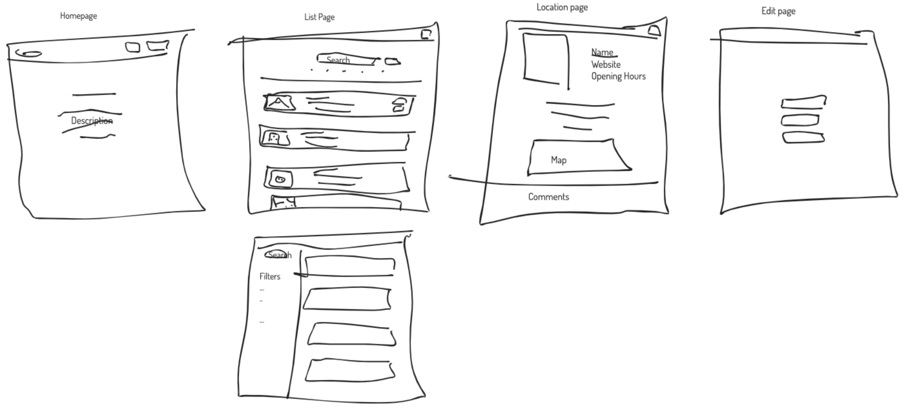

###  

### General Assembly, Software Engineering Immersive

# Green World

## Overview

This project was a Group Programming task - set as part of the Software Engineering Immersive Course from General Assembly.

This task involved working together to develop a Full Stack MERN application using the core technologies of - MongoDB, Express, React, and Node. This Project took place over 6 working days.

When consulting as part of a team, it was decided to design an app to help people wanting to lead a more environmentally friendly lifestyle. What we came up with was a location based app allowing users to find green business near their location and create an account in order to review or add businesses.

Find it here! --> [Green World 🤖](https://powerful-tor-10492.herokuapp.com/)


### Technical Requirements

* Work in a team, using **git to code collaboratively**.
* **Build a full-stack application** by making your own backend and your own front-end
* **Use an Express API** to serve your data from a Mongo database
* **Consume your API with a separate front-end** built with React
* **Be a complete product** which most likely means multiple relationships and CRUD functionality for at least a couple of models
* **Implement thoughtful user stories/wireframes** that are significant enough to help you know which features are core MVP and which you can cut
* **Have a visually impressive design** to kick your portfolio up a notch and have something to wow future clients & employers. **ALLOW** time for this.
* **Be deployed online** so it's publicly accessible.

### Concept 
We chose to build a platform to help you live a greener life: ***GreenWorld***. The idea was to enable users to **easily find local businesses and services that lower the carbon footprint** (Vegan/vegetarian restaurants, cycling shops, ethical groceries, EV charging stations, repair shops, charity shops etc.).

### Key features:
* A map with pins for all 'green' locations in the UK
* "Use my location" button to capture browser location of user
* List of all locations, with search by name and filter by categry
* Pages for each location with location details, comments and ratings
* User accounts and profiles
* Ability for users to comment and rate locations
* Ability for users to add and edit locations
* Responsive design

### Wireframes


## Technologies

* HTML
* CSS / SASS
* Bulma
* JavaScript (ES6)
* React
* Git and GitHub
* MongoDB
* Express
* Node.js
* Ziteboard
* Cloudinary
* APIs ( [Yelp](https://www.yelp.com/developers/documentation/v3), [mapbox](https://docs.mapbox.com/api/))


## Approach

### - SingleLocation Page:

I took on the task of implementing the single page layout and its functionalities. 
Page functionalities:

- I used an useEfect and Axios to fetch data from the seeded database

```js
  const [location, updateLocation] = useState([])

  useEffect(() => {
    axios.get(`/api/locations/${locationId}`)
      .then(resp => {
        updateLocation(resp.data)
      })
  }, [])

```

- The array received from the fetch was mapped through to fill the relevant tiles of the location page. 

```js
<figure className="image is-4by3">
	
</figure>
```
- The tiles would be hidden if the seeded field is empty using a ternary.

```js
{location.timings && <article className="tile is-child box">
	<div className="columns">
		<div className="column is-2">
			<FontAwesomeIcon icon={faClock} color='#056674' size='3x' />
		</div>
		<div className="column">
			<p className="title ">Opening Hours</p>
			<p className="content is-capitalized mb-0">{location.timings}</p>
		</div>
	</div>
</article>}

```

- To represent the different categories associated with the location, the data.category was mapped through and displayed using Bulma Tags

```js
{location.category.map((category, index) => {
	return <div className="tag is-warning" key={index}>
		{category}
    </div>
  })}
```

- The different sections of the page are divided by individual tiles (using Bulma). 

I started with a section called ancestor that wraps all the tiles, then the rest of the tiles were added within.

For example, in the contact section, Bulma tiles allow creating a parent column vertically which can have children depending on it. A ternary is also used to hide each tile, in case that the data is not available.

```js
{/* Location Address, opening hours and contact details if data available */}
  <div className="tile is-parent is-vertical">
    <article className="tile is-child box">
      <div className="columns">
        <div className="column is-2">
          <FontAwesomeIcon icon={faAddressCard} color='#056674' size='3x' />
        </div>
        <div className="column">
          <p className="title ">Where to find it</p>
          <p className="content mb-0">{location.address}</p>
          <span className="content mb-0">{location.postcode}, </span>
          <span className="content mb-0">{location.city}</span>
        </div>
      </div>
    </article>

    {location.timings && <article className="tile is-child box">
      <div className="columns">
        <div className="column is-2">
          <FontAwesomeIcon icon={faClock} color='#056674' size='3x' />
        </div>
        <div className="column">
          <p className="title ">Opening Hours</p>
          <p className="content is-capitalized mb-0">{location.timings}</p>
        </div>
      </div>
    </article>}

    {location.phone && <article className="tile is-child box">
      <div className="columns">
        <div className="column is-2">
          <FontAwesomeIcon icon={faPhoneAlt} color='#056674' size='3x' />
        </div>
        <div className="column">
          <p className="title ">
            Contact</p>
          {/* <p className="content mb-0">{location.email}</p> */}
          <p className="content mb-0">{location.phone}</p>
        </div>
      </div>
    </article>}
  </div>
</div >

```

- Display the location's coordinates into a static map using Mapbox

In order to add the map functionality, I used React MapGL library from Mapbox. This time I implemented the React MapGL code into a separate component called Map.js, by passing the location data as a prop from the SinglePage.js component.

```js
{location.latitude && <div className="columns is-centered m-1 is-mobile"><Map location={location} /></div>}

```
React MapGL requires an API key from Mapbox, specific information about the viewport where the map will be displayed, like the hight and width of the map area, the zoom view and the coordinates of the area. I used the Marker prop to mark the location in the map, using FontAwesomeIcon as the marker styling.

```js
import MapGL, { Marker } from 'react-map-gl'
import '../../node_modules/mapbox-gl/dist/mapbox-gl.css'
const Map = (props) => {
  // console.log(props)

  const [viewPort, setViewPort] = useState({
    height: '250px',
    width: '52rem',
    zoom: 15,
    latitude: props.location.latitude,
    longitude: props.location.longitude
  })

  return <MapGL
    mapboxApiAccessToken={process.env.MapBoxKey}
    scrollZoom={false}
    {...viewPort}
    onViewportChange={(viewPort) => setViewPort(viewPort)}
  >
    <Marker
      latitude={props.location.latitude}
      longitude={props.location.longitude}
    >
      <div>
        <FontAwesomeIcon color="green" icon={faMapPin} />
        <span> {props.location.name} </span>
      </div>
    </Marker>
  </MapGL >
}
```

- Display and Post reviews to the location

An unregistered user will only be able to see any review given to the location and will have access to the review user information by clicking in the name, in the contrary, registered users will be able to post a new review (This option will be hidden if the user has already provided a review of the site), as well as edit or remove a review posted by the current user.

To handle the ratings, I used React Ratings library

```js
// * Function to summit the changes in the comment inputs
function handleComment(event) {
event.preventDefault()
axios.post(`/api/locations/${locationId}/comments`, formData, {
  headers: { Authorization: `Bearer ${token}` }
})
  .then(resp => {
    if (resp.data.errors) {
      updateErrors(resp.data.errors)
    } else {
      updateFormData({
        text: '',
        rating: null
      })
      updateLocation(resp.data)
    }
  })
}

// * Function to delete the comment (only available to the comment creator)
function handleDeleteComment(commentId) {
axios.delete(`/api/locations/${locationId}/comments/${commentId}`, {
  headers: { Authorization: `Bearer ${token}` }
})
  .then(resp => {
    updateLocation(resp.data)
  })
}
  
{/* Reviews & Rating given to current site, with user name and avatar  */}
<div className="content">
{location.comments && location.comments.map(comment => {
  return <div key={comment._id} className="media">
    <figure className="media-left">
      <Link to={`/users/${comment.user._id}`} className="subtitle">
        <strong className="is-capitalized">{comment.user.username}</strong>
      </Link>
      <p className="image is-64x64">
        
      </p>
    </figure>
    <div className="media-content">
      <div className="content">
        <Rater
          total={5}
          rating={comment.rating}
          interactive={false}
          className="react-rater"
        />
        <p>{comment.text}</p>
      </div>
    </div>

    {/* Edit and Delete buttons available to review creator only */}
    {isCreator(comment.user._id) && <div className="media-right is-justify-content-center">
      <Link to={`/locations/edit-comment/${locationId}/${comment._id}`} className="edit mr-1">
        <FontAwesomeIcon icon={faEdit} color='#CECECE' />
      </Link>
      <button className="delete"
        onClick={() => handleDeleteComment(comment._id)}></button>
    </div>}
  </div>
})}
</div>

{/* POST review box (only available for logged in users that haven't already review this site) */}
<div className="media"></div>
{localStorage.getItem('token') && !location.comments.some(comment => {
return comment.user._id === userId
}) &&
<div className="media">
  <figure className="media-left">
    <p className="image is-64x64">
      
    </p>
  </figure>
  <div className="media-content">
    <div className="field">
      <form className="control"
        onSubmit={handleComment}
      >
        <Rater
          total={5}
          onRate={setRating}
          className="react-rater"
          rating={currentRating}
        />
        {(currentRating === 0) && <p > {'Please enter a rating'} </p>}
        {errors.rating && <p style={{ color: 'red' }}>
          {`There was a problem with your ${errors.rating.path}`}
        </p>}
        <textarea
          className="textarea"
          value={formData.text}
          name="text"
          placeholder="Write your review"
          onChange={handleChange}
        >
          {errors.text && <p style={{ color: 'red' }}>
            {`There was a problem with your ${errors.text.path}`}
          </p>}
        </textarea>
        <div className="field">
          <p className="control">
            <button
              className="button is-link  my-1"
            >
              Submit
            </button>
          </p>
        </div>
      </form>
    </div>
  </div>
</div>}
   
```

### - EditLocation & LocationForm Page:

I also implemented the EditLocation Page, which in essence, populates the original data of the location into the empty input fields of the form, so the user can decide what information has to be edited.

-   UseState to update the empty fields with the original and edited location data. As well as defined the different categories available in an object called categoriesObject.


```js
  const [formData, updateFormData] = useState({
    category: [],
    address: '',
    name: '',
    timings: '',
    // startDate: '',
    // endDate: '',
    city: '',
    postcode: '',
    longitude: '',
    latitude: '',
    website: '',
    email: '',
    phone: '',
    bio: '',
    image: ''
  })
  
    // * This variable defines the different categories in the select input
  const categoriesObject = [
    { value: 'Farmers Market', label: 'Farmers Market' },
    { value: 'Farm Shop', label: 'Farm Shop' },
    { value: 'Sustainable Groceries', label: 'Sustainable Groceries' },
    { value: 'Restaurant', label: 'Restaurant' },
    { value: 'EV Charging Station', label: 'EV Charging Station' },
    { value: 'Upcycling/Repair', label: 'Upcycling/Repair' },
    { value: 'Circular Economy', label: 'Circular Economy' },
    { value: 'Cycling', label: 'Cycling' }
  ]
```

- Populate the original location data into the form fields

1 - I used an useEffect to fetch the data from the edited location.

2 - I cloned the data and filtered the categoriesObject to return an array with the matching categories with the edited location

```js
  // * Fetch the original location data and filter the categories that the location has preselected
  useEffect(() => {
    Axios.get(`/api/locations/${locationId}`)
      .then(({ data }) => {
        const formData = {
          ...data,
          category: categoriesObject.filter(option => {
            return data.category.some(category => {
              return category === option.value
            })
          })
        }
        updateFormData(formData)
        // console.log(formData)
      })
  }, [])
```
- 

3 - I separated the form into another component called LocationForm.js, to ensure the best performance of the React Select Library used as the select input for the array of categories in the form. This way, I can pass the array of filtered categories set in the data fetch as a prop to LocationForm to set them as the initial value of the select input. 

EditLocation.js - Passing the original data as props to FormLocation

```js
 // * The form has been split into a separate component LocationFrom.js
  return <LocationForm
    handleSubmit={handleSubmit}
    // inputFields={inputFields}
    formData={formData}
    updateImage={updateImage}
    selectedCategories={formData.category}
    setSelectedCategories={setSelectedCategories}
    // startDate={startDate}
    // endDate={endDate}
    // setStartDate={setStartDate}
    // setEndDate={setEndDate}
    options={categoriesObject}
    handleChange={handleChange}
  />
}
```

FormLocation.js - E.g. React Select

```js
      <div className="is-multiple control">
        <Select
          closeMenuOnSelect={false}
          value={selectedCategories}
          onChange={setSelectedCategories}
          components={makeAnimated()}
          options={options}
          isMulti
          autoFocus
          isSearchable
          placeholder="Select the category available"
          className="basic-multi-select"

        />
      </div>
  
```

4 - Once the user edits and submit the form, the new data is PUT into our seeded data using Axios in the function handleSubmit(), that will bring the user back into the SingleLocation page with the applied changes

```js
 // * Function to summit the changes from the form inputs to the seeded data
  function handleSubmit(event) {
    event.preventDefault()
    // console.log(event)
    const token = localStorage.getItem('token')
    const newFormData = {
      ...formData,
      // startDate: startDate,
      // endDate: endDate,
      category: formData.category.map(selected => {
        return selected.value
      })
    }
    Axios.put(`/api/locations/${locationId}`, newFormData, {
      headers: { Authorization: `Bearer ${token}` }
    })
      .then(resp => {
        props.history.push(`/locations/${locationId}`)
      })
  }
```

### UploadImage.js (used in Register.js, EditUser.js & EditLocation.js)

I implemented React Cloudinary library by creating two components called CloudinaryService.js & UploadImage.js, to allow users to upload their avatars to their profile, as well as uploading images to the locations they created.

The first component, CloudinaryService.js, has all the core settings to link the application to the Cloudinary account.

The second component, UploadImage.js, is in charge of the upload widget and updating the data. has two functions:

- beginUpload() - Opens the Cloudinary Widget to allow the user to upload the image into the Cloudinary database
- setImages() - Adds the uploaded image into the form data.

```js
const UploadImage = (props) => {
  const [images, setImages] = useState([])
  const beginUpload = tag => {
    const uploadOptions = {
      cloudName: 'greenupload',
      tags: [tag],
      uploadPreset: 'upload'
    }

    openUploadWidget(uploadOptions, (error, photos) => {
      if (!error) {
        console.log(photos)
        if (photos.event === 'success') {
          setImages([...images, photos.info.public_id])
          // console.log(photos.info.public_id)
          props.updateImage(photos.info.secure_url)
        }
      } else {
        console.log(error)
      }
    })
  }

  useEffect(() => {
    fetchPhotos('image', setImages)
  }, [])
  return <div>
    < CloudinaryContext
      cloudName="greenupload"
    >
      <div className="App">
        <div className="button" onClick={() => beginUpload()}>Upload Image</div>
        <section>
          {images && images.map(index => <div key={index}>
            <br />
            <Image publicId={index}/>
            <Image />
          </div>)}
        </section>
      </div>
    </ CloudinaryContext>
  </div >
}
```

### - AddLocation

The AddLocation page is a form that captures each keystroke in a `const` via `useState`.

```js
const [formData, updateFormData] = useState({
  category: [],
  address: '',
  name: '',
  timings: '',
  [...]
})

function handleChange(event) {
  const data = {
    ...formData,
    [event.target.name]: event.target.value
  }
  updateFormData(data)
  }
```

For the category selection we used a the `react-select` library. And for the image upload we used *Cloudinary*.

When the user clicks the 'Submit' button, the postcode gets sent to the geocoding endpoint of the *mapbox* API. 

```js
function handleSubmit(event) {
  event.preventDefault()
[...]
  }
  Axios.get(`https://api.mapbox.com/geocoding/v5/mapbox.places/${formData.postcode}.json?access_token=${process.env.MapBoxKey}`)
    .then(resp => {
      const data = {
        ...formData,
        longitude: resp.data.features[0].center[0],
        latitude: resp.data.features[0].center[1]
      }
      updateFormData(data)
[...]
```

This returns the corresponding coordinates and is necessary for us to place a pin on the map for this location.
The complete information typed in the form and returned from the *mapbox* API is then stored in our database.

```js
[...]
return Axios.post('/api/locations', data, {
  headers: { Authorization: `Bearer ${token}` }
})
  .then((resp) => {
    if (resp.data.errors) {
      updateErrors(resp.data.errors)
    } else {
      props.history.push('/locations')
    }
  })
[...]
```

### - The Backend

The backend conatined a router file to handle the different requests from the frontend using functions imported from controller files. An example route from the router file:

```js
router.route('/locations/:locationId/comments/:commentId')
  .get(locationController.getComment)
  .put(secureRoute, locationController.updateComment)
  .delete(secureRoute, locationController.deleteComment)
```
For this route, the request from the front end would contain the information required to specify a specific comment on a location in our database. Depending on the type of request (GET, PUT, or DELETE) a different fuction would be used. As an example, this is a function found in the controller file:

```js
function getAllComments(req, res) {
  Locations
    .find()
    .then(locationList => {
      const allComments = []
      const user = req.params.userId
      locationList.forEach(location => {
        for (let i = 0; i < location.comments.length; i++) {
          if (JSON.stringify(location.comments[i].user) === `"${user}"`) {
            const commentObject = {
              comment: location.comments[i],
              location: location.name,
              locationId: location._id

            }

            allComments.push(commentObject)
          }
        }
      })
      res.send(allComments)
    })
    .catch(error => res.send(error))
}
```
This function is retrieving all of the locations in our database and running a for loop in each location. The for loop is going though the array of comments attached to the location and pushing any comment from the specified user into a new array (allComments). This array is then sent back in the response in order to return all of the comments a specific user has posted on the app.

Some functions on the app requre the user be logged in before access is granted. For these functions secureRoute, a function imported from our middleware, would be added to the route:

```js
function secureRoute(req, res, next) {
  const authToken = req.headers.authorization

  if (!authToken || !authToken.startsWith('Bearer')) {
    return res.status(401).send({ message: 'Unauthorized - There\'s no token or you\'re missing the word \'Bearer\'' })
  }

  const token = authToken.replace('Bearer ', '')

  jwt.verify(token, secret, (err, payload) => {

    if (err) return res.status(401).send({ message: 'Unauthorized - The token isn\'t valid' })

    const userId = payload.sub
    console.log(userId)
    User
      .findById(userId)
      .then(user => {
        if (!user) return res.status(401).send({ message: 'Unauthorized - User not found' })

        req.currentUser = user

        next()
      })
      .catch(() => res.status(401).send({ message: 'Unauthorized - Error related to user' }))
  })
}
```
This function ensures that the user is currently logged in to an account with valid token before performing the relevant functions and returning the repsonse, otherwise a 401 status with the message 'Unauthorized' would be returned instead.

## Potential Future Features

- Locations page could display business based on proximity to the user instead of alphabetical order.
- The Map could cluster locations when there are too many within the viewport
- Seeding more locations to the databased, not only London.

## Challenges
* To retrieve the array of categories from the edited location and match the selected ones from the categoriesObject, so they can be displayed as the initial value in the React Select component. This issue was resolved by filtering all the categories with the original categories, with the resulted array, it was then passed on as a prop to the form component.

* To implement Cloudinary and React-Rater initially, after a good investigation online and seeing different applications and tips from users, I managed to get both libraries up and running. 

## Lessons learned
- Be realistic from the stage of imagining all the functionalities and features of your application to the actual implementation of the MVP. Focus on prioritising the most important features, as any extra functionality will be able to be introduce in due course.
- Communication between team members is key for the success of the project, don't be afraid of asking for help when in doubt, as the team members might be also unaware and interested in knowing the solution.
- 
## Contributors
- Baltasar Romero
- Dec Burns
- Florian Wilisch
- James Bolton